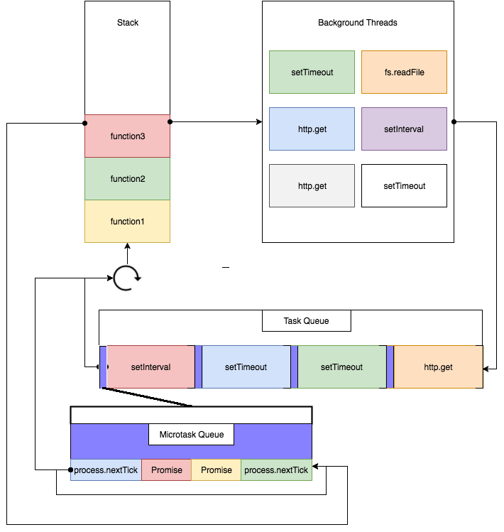

1.windows环境下
=

js中任务可以分成两种，一种是同步任务（synchronous），另一种是异步任务（asynchronous）。

同步任务指的是，在主线程上排队执行的任务，只有前一个任务执行完毕，才能执行后一个任务；

异步任务指的是，不进入主线程、而进入"任务队列"（task queue）的任务，只有"任务队列"通知主线程，某个异步任务可以执行了，该任务才会进入主线程执行。

具体来说，异步执行的运行机制如下。
```
（1）所有同步任务都在主线程上执行，形成一个执行栈（execution context stack）。

（2）主线程之外，还存在一个"任务队列"（task queue）。只要异步任务有了运行结果，就在"任务队列"之中放置一个事件。

（3）一旦"执行栈"中的所有同步任务执行完毕，系统就会读取"任务队列"，看看里面有哪些事件。那些对应的异步任务，于是结束等待状态，进入执行栈，开始执行。

（4）主线程不断重复上面的第三步。
```

任务队列中存放的函数：定时器，ajax对象，dom时间等异步回调函数。（new promise内如果没有异步函数就属于主程序）

微任务队列：位于任务队列开头，例如promise.then中的回调函数放入此队列中。

```js
setTimeout(()=>console.log('a'),0);
var p=new promise(resolve=>{
  console.log('b');//主程序
  resolve();
})
p.then(()=>console.log('c'))//微任务
p.then(()=>console.log('d'))
console.log('e')
//结果becda
```

2.nodejs环境中
=

nodejs新增process.nextTick位于微任务队列开头


